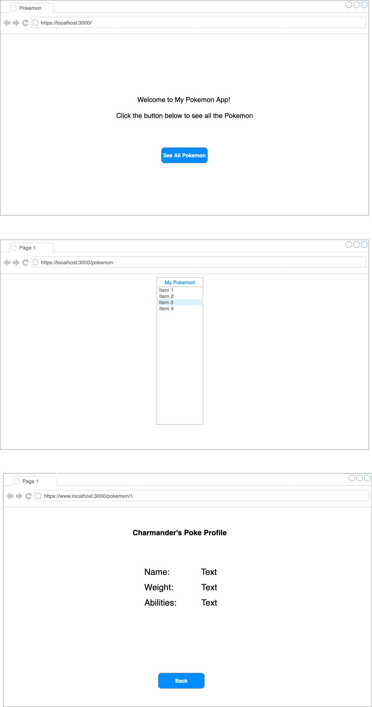

# PokéApp

You will be building a Pokémon app in **React** using this super neat, super free [PokeApi](https://pokeapi.co/)!

## Here's your mockups:

## Here's your mission:

Build an app that has 3 routes
1. `"/"` - will welocme the user to the site with a button or link to go to the all pokemon page

1. `"/pokemon" ` renders the names of the first 151 Pokémon in the pokéapi database on page load as links to individual pages

1. ` "/pokemon/:id"` When the user clicks a name, the app should render a new route with information about that Pokémon, including the **name** and **weight**. It should also have a back button that takes the user back to the `"/pokemon"` route

## Deliverables

1. Tackle app above with React. Make sure to write clean code, with frequent git commits. Don't forget to style it and make it look good.

## Bonus

Add the Pokémon's abilities to the rendered profile (see mockup above).

## Completion

Fork and clone this repo, complete the application, and submit your pull request.
